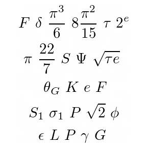

# Stairway Constants

 

_Stairway Constants_ is my award winning\* 2020 article series in mathNEWS, a student publication in the Math Faculty at the University of Waterloo covering the satirical, the serious, the sexy, and everything in between. What is _Stairway Constants_ about? From the final article:

> There is a stairwell in the main mathematics building on campus (MC), from the basement all the way to the 7th floor penthouse. Along that stairwell runs a number line painted on the walls, with silvery plaques marking various important mathematical constants. You can find celebrities like the golden ratio and π, interspersed between oddities like the prime constant and 2e.

The first 5 articles of the series covered the constants in increasing order, and were published in the Winter 2020 (pre-pandemic) volume of mathNEWS:

1. _Stairway Constants, part [0,1)_: [v142i1](https://mathnews.uwaterloo.ca/wp-content/uploads/2020/01/mathNEWS-142-1.pdf) (a.k.a. the infamous "UWUSA" issue)
2. _Stairway Constants, part [1,2)_: [v142i2](https://drive.google.com/file/d/1TXqhE6Dd2HjC7St6oKBF0Xv0lTNiaZ3b/view)
3. _Stairway Constants, part [2,3)_: [v142i3](https://mathnews.uwaterloo.ca/wp-content/uploads/2020/02/mathNEWS-142-3.pdf)
4. _Stairway Constants, part [3,4.5)_: [v142i4](https://mathnews.uwaterloo.ca/wp-content/uploads/2020/02/mathNEWS-142-4.pdf)
5. _Stairway Constants, part [4.5,7]_: [v142i5](https://mathnews.uwaterloo.ca/wp-content/uploads/2020/03/mathNEWS-142-5.pdf)\*

If you're lucky, you might be able to find copies of these in print.

The final article of the series covered the contributions of the faculty and staff members who made the stairwell decoration happen in the first place. It was published in the Fall 2020 volume, online.

6. _Stairway People_: [v144i3](https://mathnews.uwaterloo.ca/wp-content/uploads/2020/10/mathNEWS-144-3.pdf)

It was a labour of love. Researching and writing _Stairway Constants_ took more work than some of my courses, and it was completely voluntary. Unlike some of my older writings, I continue to be proud of it. This repository is a long-overdue web revision of the series. I hope it is worth the wait, for those who requested it.

---

\* article of the issue, which comes with a not-to-be-scoffed-at $25 gift card prize
